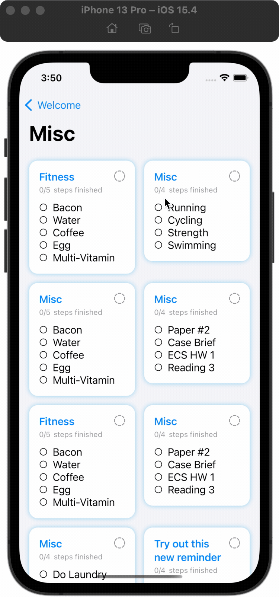
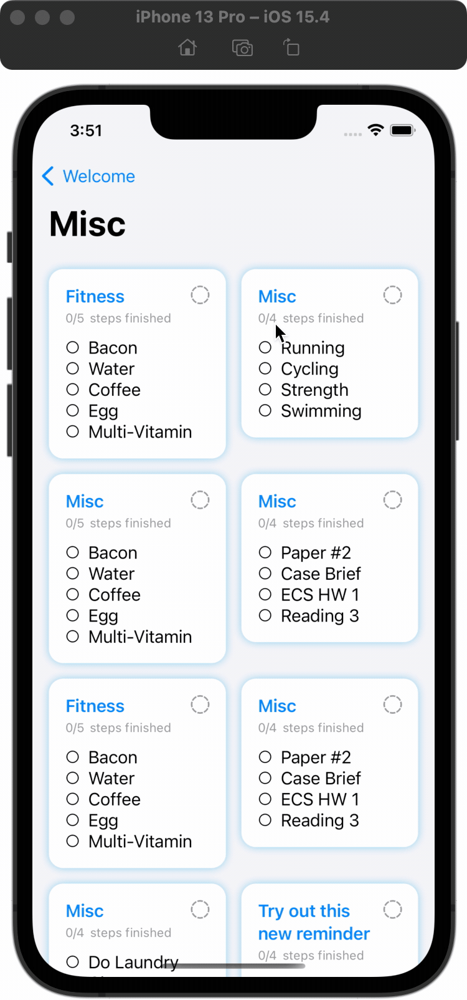
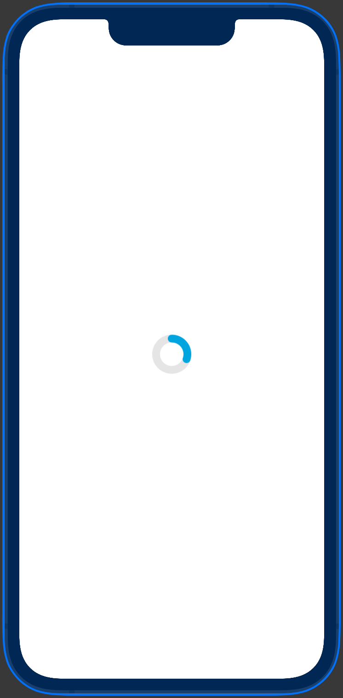
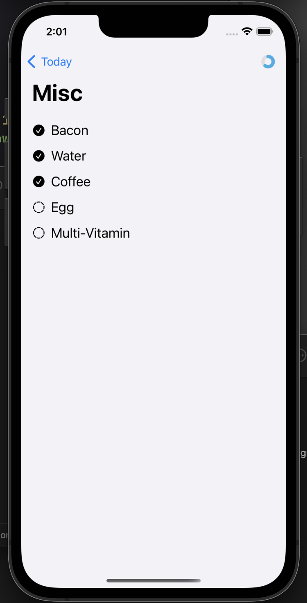
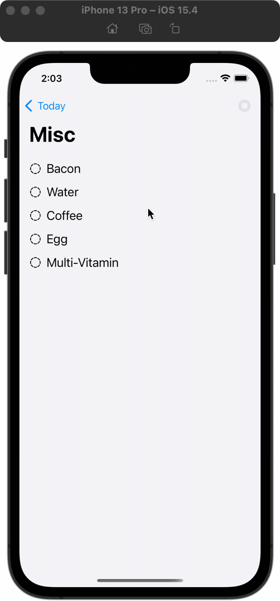
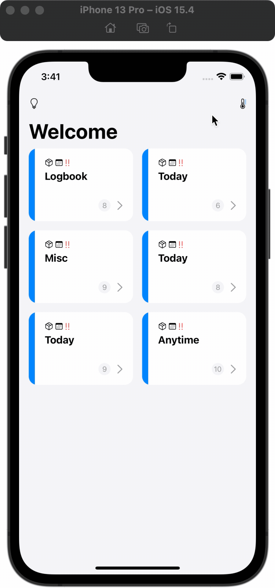
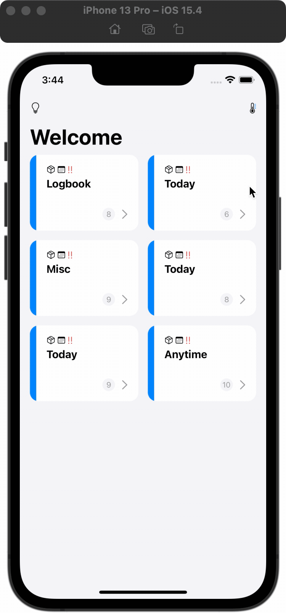
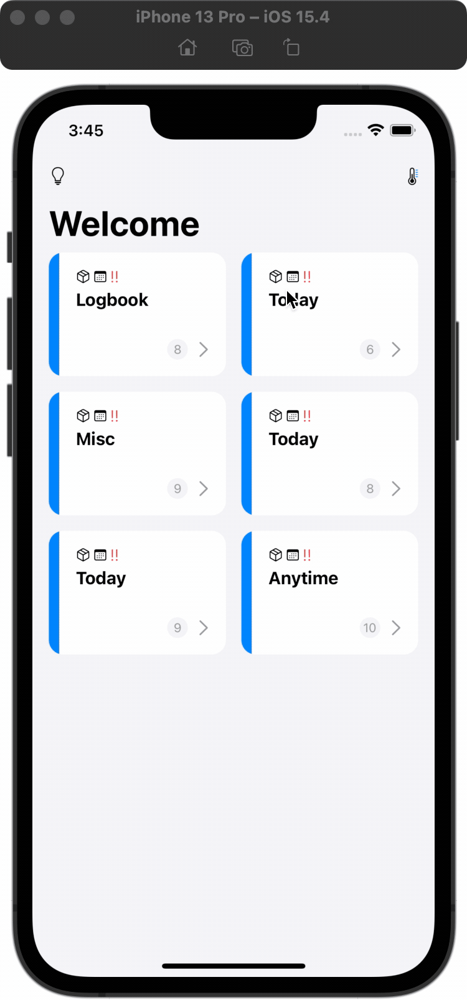

In this assignment, you will apply some animations, view transitions, and navigations.

Before starting this assignment, you may want to take a look at the skeleton code. The hardest part (in my opinion) of this assignment will be reading and understanding the code provided to you. With that being said, please start this assignment as soon as possible.

Since this assignment is designed to be finished in 1 week, we have done many things for you, like managing data and organizing files and structure by following MVVM. All these things are crucial when you are working on your own. Therefore, if you have time, we'd highly recommend you go through these files and make sure you know how to do these things.

## Overview

For this assignment, we added several files and folders. This overview will tell you whether you need to thoroughly look into certain files, as some are crucial for your assignment, but some are not.

1. `Protocols` Folder (YOU CAN SKIP THIS FOLDER)
   
   This folder includes a file, `IORepository.swift`. This file defines a protocol regarding CRUD operations. You don't need to know the detail of this file.

2. `Repository` Folder (YOU CAN SKIP THIS FOLDER)
   
   This folder includes two files - `ReminderGroupRepository.swift` and `ReminderRepository.swift`. Both files provide methods for acccessing the data with concrete implementations of CRUD operations.

3. `Extensions` Folder (YOU NEED TO PAY ATTENTION)
   
   Inside `Extensions` folder, we provide a `View+Progressable.swift` file. You will work on this file.

4. `Models` Folder (YOU CAN TAKE A QUICK LOOK)
   
   Still, you have both `Reminder.swift` and `ReminderGroup.swift` here. However, we've updated both files and now they supports some additional functions, such as adding reminders. You won't need to explictly call any function from them directly.

5. `ViewModels` Folder (YOU NEED TO PAY ATTENTION)
   
   We provide three view models for you. You won't need to modify these files extensively. However, you will work with view models closely (recall the MVVM pattern)! Therefore, you may want to take a close look at these files and functions it provides.

6. `ViewModifiers` Folder (YOU WILL WORK ON ONE FILE)
   
   You will need to make a `Progressable` view modifier in the `Progressable.swift` file.

7. `Views` Folder (YOU NEED TO PAY ATTENTION)
   
   In this assignment, you will majorly work on views. Therefore, all files inside this folder will be pretty important. You definitely want to take a close look at all files.

   We also reorganized files. Now, all main views that will be used to represent the main UIs of our app are placed inside the folder `MainViews`. We also prepared an empty `InspirationView` inside the folder `InspirationViews`.

8. `UserData.swift` (YOU CAN SKIP THIS FILE)
   
   This file is also updated. You won't directly call any function inside this file in this assignment. However, we will come back to this file when we get to persistence.

### Files You will Work on
- `Extensions` Folder
  - `View+Progressable.swift`
- `ViewModifiers` Folder
  - `Progressable.swift`
- `Views` Folder
  - `MainViews` Folder
    - `GroupView.swift`
    - `ReminderView.swift`
  - `InspirationViews` Folder
    - `InspirationView.swift`
  - `CircularProgressView.swift`

## Stage 1 (45 Pts in total)

> Link all views together.

Note: the `ContentView.swift` is renamed to `GroupView.swift`.

In this stage, you need to link every view together. The final expected product of this stage should be like this:

| Navigation Enabled | Progressable View Modifier | Scale-down & Grey-out Animations |
| :---: | :---: | :---: |
|  |  |  |

### Stage 1.1 (20 Pts)

Before starting this stage, you have to take a look at `GroupView.swift`, `GroupCardView.swift`, `ReminderView.swift`, `ReminderCardView.swift`, and `DetailView.swift`.

You also need to understand their relationship with each other.

The `GroupView` is the main entry view. It lists all `GroupCardView`s, representing all different `ReminderGroup`s in a card-like view. When you click on any `GroupCardView`, you should be navigated to `ReminderView`, displaying all reminders inside that reminder group. Each reminder in the `ReminderView` is displayed as `ReminderCardView`. When you click on any `ReminderCardView`, you should be navigated to `DetailView`, where all steps will be displayed.

**What to Implement (in the file `ReminderView.swift`)**
- You need to use `LazyVGrid` to display all `ReminderCardView` in a two-column style.
- You need to display the name of the corresponding reminder group as the navigation title.
- You need to use `NavigationLink` to enable the navigation between `ReminderView` and `DetailView`.
- You need to use `.environmentObject()` to inject the `reminderVM` into the `DetailView`.

**Grade Breakdown:**

* (5 pt) Correctly display ReminderCardView in the two-column style.
* (5 pt) Correctly display the name of the corresponding reminder group as the navigation title.
* (5 pt) Correctly use `NavigationLink` to bridge `ReminderView` and `DetailView`.
* (5 pt) Correctly inject environment object.


> **Note**  
> MVVM is an important topic. To make sure you can finish this assignment in 1 week, we have provided a skeleton code that follows MVVM. However, you need to know how we pass data (view model) between different views.

### Stage 1.2 (25 Pts)

In this sub-stage, you need to create a native-like view modifier `.progressable`, so that we can apply this progress ring to our `ReminderCardView` easily. Additionally, we will add a scale-down effect and animation when the entire reminder is marked as finished. You also need to animate the gray-out effect you've done in assignment 1.

1. Before you start, you first need to look at the file `ReminderViewModel.swift`. You need to implement the computed variable `var stepProgress: Double`. It should return a value between 0 and 1. It returns 0 when no step is finished and returns 1 when all steps are finished.

2. Now, take a look at `View+Progressable.swift` under the folder `Extensions` and `Progressable.swift` under the folder `ViewModifier`. You need to complete both files so that we can do something like `.progressable()` on any view.

3. After that, let's go back to the file `ReminderCardView.swift`. You need to apply the `.progressable()` view modifier to this view so that we can have a progress ring. Remember, you need to ensure the `stepProgress` is synced.

4. Apply a scale-down animation. When the entire reminder is finished, you need to scale/shrink this card view down a bit. You can go with a scale factor of 0.95 or 0.9 or something else. Pick any value you think is reasonable.

5. You also need to ensure that the gray-out effect you've done in assignment 1 should be properly animated. For this skeleton code, you can look at the file `Views/MainViews/ReminderCardView.swift` line 119 the function `conditionalBackground()`.

   ``` swift
   if reminder.finished {
      Color.gray.opacity(0.1)
         .cornerRadius(viewConstant.cardCornerRadius)
   }
   ```

This is the gray-out effect applied to the card view. You can start from that.

**Grade Breakdown:**

* (5 pt) Correctly implement the `stepProgress` computed variable.
* (5 pt) Correctly implement the Progressable view modifier in both `View+Progressable.swift` and `Progressable.swift` files. 
* (5 pt) Correctly apply the `.progressable()` view modifier on the `ReminderCardView`.
* (5 pt) Correctly implement the visible scale-down animation (not just the effect) when the entire reminder is marked as finished.
* (5 pt) Correctly animate the gray-out effect when the entire reminder is marked as finished.


## Stage 2 (15 Pts in total)

> Create your own circular progress ring!

In this stage, your goal is to make a fully animated circular progress view! The expected final product should be like this:

| In Preview | In App | In App (GIF) |
| :---: | :---: | :---: |
|  |       |      |  

### Stage 2.1 (10 Pts)

In this sub-stage, you will finish the circular progress view. Go to the file `Views/CircularProgressView.swift`.

You have four properties defined for you:
1. `activeColor`: the color of your circular ring.
2. `strokeWidth`: the width of your circular ring stroke.
3. `stepProgress`: a value from 0 to 1, indicating the ratio.

Go ahead and implement the `CircularProgressView`. Please refer to the `Grade Breakdown` below for the implementation details.

**Grade Breakdown:**

* (5 pt) Correctly implement `CircularProgressView` with similar color and style as the image suggested.
* (5 pt) Correctly implement the animation when the `stepProgress` changes.

### Stage 2.2 (5 Pts)

In this sub-stage, you will add this newly created `CircularProgressView` to the `DetailView`.

Go to the file `Views/MainViews/DetailView.swift`.

Add the `CircularProgressView` as a trailing navigation toolbar item.

**Grade Breakdown:**

* (5 pt) Correctly show and animate the `CircularProgressView` in `DetailView`.


## Stage 3 (30 Pts in total)

In this stage, you will open up the `InspirationView`, and implement a two-phase animation to expand or shrink the `InspirationView`. The final expected product of this stage should be like this:

| Open and Close with Button Click | Close by Clicking on Backdrop | Two-phase Panel |
| :---: | :---: | :---: |
|  |  |  |

### Stage 3.1 (10 Pts)

Before you start, first, you have to add two buttons/icons as navigation toolbar items to our `GroupView.swift`.

Go to the file `MainViews/GroupView.swift` and add these two buttons/icons.

- Leading Toolbar Item
  - It's a button. You can use the button to open up the `InspirationView` later. The SF Symbols used in the reference app for this item are `lightbulb` and `lightbulb.fill` for closed and opened, respectively.

- Trailing Toolbar Item
  - It's simply an SF Symbol. The icon used in the reference app is `thermometer`.

**Grade Breakdown:**

* (5 pt) Correctly add the leading toolbar item.
* (5 pt) Correctly add the trailing toolbar item.


### Stage 3.1 (10 Pts)

Take a look at the file `InspirationView.swift` to have a general idea about this view. Now, go back to the files `MainViews/GroupView.swift`. You will also need to edit `InspirationView` in this sub-stage.

You need to implement the open and close action for the `InspirationView`.

**Grade Breakdown:**

* (5 pt) Be able to open up the `InspirationView` by clicking on the leading toolbar item with the proper transition.
* (2.5 pt) Be able to close the `InspirationView` by clicking on the close button inside `InspirationView` with the proper transition.
* (2.5 pt) Be able to close the `InspirationView` by clicking on the `backdropLayer` inside `InspirationView` with the proper transition.

### Stage 3.2 (10 Pts)

The `InspirationView` should have a two-phase panel. By default, when we open up the `InspirationView`, it takes half the screen. You can expand it to full screen if you want. Of course, you can also shrink it back.

You need to implement this two-phase opening with proper animations.

To get the size of the screen, you can use the `screenSize`, `screenHeight`, or `screenWidth` computed variables defined in `InspirationView.swift`. Just use the variable you need.

Hint: to implement the two-phase opening panel, you can try to adjust the frame of the view.

**Grade Breakdown:**

* (5 pt) Be able to open up the `InspirationView` with proper animations that take only half the screen height by default. 
* (5 pt) Be able to expand the `InspirationView` with proper animations and also be able to shrink it back. 


## Stage 4 (10 Pts in total)

> Commit, Push, and Submit

Remember to commit your code changes and push the change to GitHub before the deadline.

Even if you intend to use late policy, you still need to submit your repository link on Canvas before the original deadline to receive the 10 points.

**Grade Breakdown:**
- (10 pt) A valid GitHub repository link is submitted on Canvas before the original deadline.
