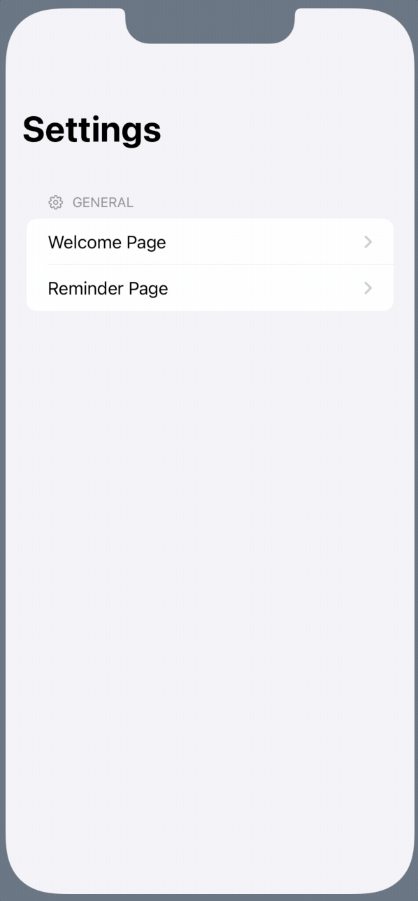
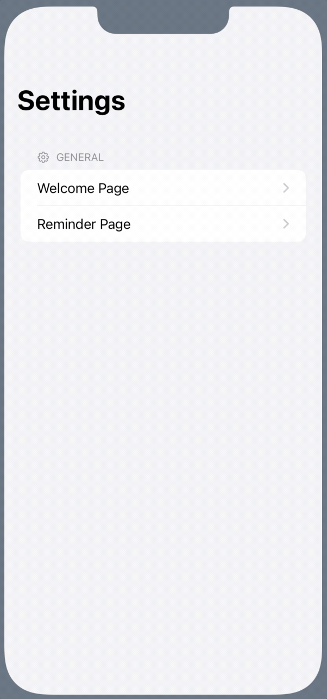
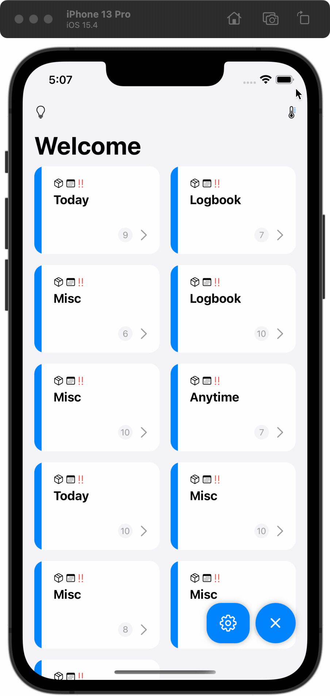

In this assignment, you will take a further step to explore the usage of different tools provided by SwiftUI, such as `@EnvironmentObject`, `@ObservedObject` and more.

> Notes: In this assignment, you might have some trouble to make the preview work. One highly possible reason is that you declare a `@EnvironmentObject` in your view and the environment object is supoosed to be passed from ancestor views, but the preview doesn't have such information. In this case, you may want to pass a `@EnvironmentObject` to your preview to make it work.

## Stage 1 (55 Pts in total)

> Let's create a settings view!

In this stage, you need to create a model, a view model and a view for the settings view. The settings view won't be reachable directly in your app by the end of this stage. However, we will link the settings view in the following stages. At that time, you should be able to open the settings view and check the correctness of your implementation in this stage by changing things on the fly.

### Stage 1.1 (5 Pts)

In this sub-stage, you need to create a model for settings. You need to create a Swift file named `Settings.swift` in the folder `Models`. You can name your struct as `Settings`.

In this model file/struct, you are required to provide four properties.
1. `var showProgressRing: Bool`   
   You can set the default value to `true`. This property will be used to determine whether users want to display the progress bar on the `ReminderCardView`.
2. `var showStepsPreview: Bool`  
   You can set the default value to `true`. This property will be used to determine whether users want to preview the steps on the `ReminderCardView`.
3. `var maxNumOfStepsPreview: Int`  
   You can set the default value to `3`. This property will be used to determine how many steps users want to preview on the `ReminderCardView` if the `showStepsPreview` is marked as `true`. 
4. `var welcomeGreetings: String`  
   You can set the default value to `Welcome`. This property will be used to display the navigation title in the landing view of our app, which is the `GroupView`.

**Grade Breakdown:**

* (2 pt) Correctly create the required model named `Settings` in the right folder with the right filename.
* (2 pt) Correctly create `var showProgressRing: Bool` property.
* (2 pt) Correctly create `var showStepsPreview: Bool` property.
* (2 pt) Correctly create `var maxNumOfStepsPreview: Int` property. 
* (2 pt) Correctly create `var welcomeGreetings: String` property. 

### Stage 1.2 (10 Pts)

In this sub-stage, you need to create a view model for the `Settings` model we just created in the previous stage. You need to create a Swift file named `SettingsViewModel.swift` in the folder `ViewModels`. The name of your view model/class should be `SettingsViewModel`.

There are some requirements for this view model.

1. This view model should be a `class` (reference data type) and conform to the right protocol. You need to think about which protocol to conform.

2. In this view model, you are required to provide a variable named `settings`, presenting the `Settings` model we defined in the previous sub-stage. We will use this variable to apply settings to our views later. Namely, this variable will be changed and should be able to notify the UI to redraw them. You need to think about which property wrapper you should use to mark this variable.

2. To let you get familiar with `getter` and `setter`, you are required to provide four computed variables:
   1. `var welcomeGreetings: String`, 
   2. `var showProgressRing: Bool`,
   3. `var showStepsPreview: Bool`,
   4. `var maxNumOfStepsPreview: Int`

   These four computed variables bridges four corresponding variables defined in your local `settings` model instance. Namely, when you set a value to one of these computed variables in `SettingsViewModel`, you should use a `setter` to assign the value to the corresponding variable in the `settings` model instance. You should also use a `getter` to access the corresponding variable in the `settings` model instance when accessing one of these computed variables.

   > This step for defining four computed variables is indeed a bit boring and repetitive. However, you may see the view model acts like a middle man to respond to the UI or data changes. Therefore, when things get complicated, you may want to do some additional checkings or logics in the view model when modifying or reading the data.

**Grade Breakdown:**

* (2 pt) Correctly create the `SettingsViewModel` class in the right folder with the right filename.
* (2 pt) Correctly conform to the right protocol for the `SettingsViewModel`.
* (2 pt) Correctly mark the local `settings` model with the right property wrapper.
* (4 pt) Correctly define four computed variables with `getter` and `setter`.

### Stage 1.3 (15 Pts)

In this sub-stage, you will use the `SettingsViewModel` created in the previous sub-stage and reflect the changes of settings on your UI.

Some steps to guide you through (TODO marks are provided in some files too):

1. Go to the file `ECS198F003_Assignment3App.swift`. Declare a variable named `settingsVM`. Mark it with the right property wrapper. `@ObservedObject` vs `@StateObject`?  
2. Pass this newly declared `settingsVM` to `GroupView` as an environment object.  
3. Go to the file `GroupView.swift`. Declare an environment object which grabs the `settingsVM` view model from the environment as you just injected this view model from the parent view.  
4. Still in the file `GroupView.swift`, use the `welcomeGreetings` from the `settingsVM` to set your navigation title properly.  
5. Go to the file `ReminderCardView.swift`. Do something similar to step 2.  
6. Still in the file `GroupView.swift`, follow the TODO marks to correctly apply settings to the UI. There are 3 TODO marks.  
   > For the step of limiting the number of steps for preview, there is no requirement on how to select which step to preview, as long as you have the correct number. You can just try to use `.prefix()`, which is defined on any array by default.

**Grade Breakdown:**

* (2 pt) Correctly declare the `settingsVM` in the top level of your app with right property wrapper.
* (5 pt) Correctly grab the `settingsVM` from the environment for both `GroupView` and `ReminderCardView`.
* (2 pt) Correctly apply the welcome greeting based on settings.
* (2 pt) Correctly show/hide the progress ring based on settings. 
* (2 pt) Correctly show/hide the step preview based on settings. 
* (2 pt) Correctly limit the number of step for preview based on settings. 

### Stage 1.4 (20 Pts)

In this sub-stage, you will create a view that allow users to adjust the settings in your app.

You need to create a SwiftUI file named `SettingsView.swift` in the folder `Views/MainViews`. You have the freedom to organize your view code in any way you want, as long as you properly used `NavigationView`, `Form` and `Section` and the final product should be something like this:

| Settings for Welcome Page | Settings for Reminder Page |
| :---: | :---: |
|  |   |

To achieve the view like this, you may also need to know how to use `Toggle` and `Stepper`, which are two built-in views in SwiftUI library. These two things are not covered in the lecture and you need to figure out how to use them on your own. There are lots of built-in views in SwiftUI standard library and we won't be able to cover them all. Of course, lots of 3rd-party libraries also are out there and we won't be able to cover them in the lecture. Therefore, it's quite important for you to know how to pick up things from official documents and code examples online. Some additional resources are provided below.

- `Toggle`  
  This is an UI element to let users toggle a button. [Official Document](https://developer.apple.com/documentation/swiftui/toggle).

- `Stepper`  
  This is an UI element to let users increase or decrease a value by pre-defined amount. [Official Document](https://developer.apple.com/documentation/swiftui/stepper)

> **Remarks**  
> 1. You will practice the usage of `Binding` in both `Toggle` and `Stepper`.
> 2. You can limit the range of the `Stepper` to 1-5. Namely, we allow the user to display at most 5 steps or at least 1 steps. Of course, users can shutdown the step preview entirely.
> 3. You need to hide the view of `Stepper` if the user disable the steps preview entirely.
> 4. You may have trouble with preview. Do remember to pass an environment object to previews!
> 5. You need to use `TextField` to allow the user to customize the welcome greeting text.

**Grade Breakdown:**

* (5 pt) Correctly implement a settings view with the right section header from where the user can go into `Welcome Page` or `ReminderPage`.
* (5 pt) Correctly implement a welcome page settings view with the right section header from where the user can set the greeting text.
* (5 pt) Correctly implement a reminder page settings view with the right section header from where the user adjust the settings.
* (5 pt) Correctly show/hide the `Stepper` when the user disables the steps preview entirely.

## Stage 2 (15 Pts in total)

> Add the flyout action button and link it with your settings view!

In this stage, your goal is to add the flyout action button, which is already created for you, to your view hierarchy. After that, you need to properly set up the settings view so you can open up your settings view right from the action button. After this stage, you should be able to open your settings page from the action button and should be able to adjust the settings by changing the values in the `SettingsView`. The expected behavior is something like this:

| Open SettingsView | Edit Welcome Greeting | Disable Progress Ring | Modify Step Preview |
| :---: | :---: | :---: | :---: |
|  |   |    |   

### Stage 2.1 (10 Pts)

In this sub-stage, you need to declare a `ActionButtonViewModel` instance in the `GroupView` and add your `ActionButton` view to the right place. TODO marks are provided.

`ActionButtonViewModel` is already defined for your in the file `ViewModels/ActionButtonViewModel`.

1. Go to the file `GroupView.swift`, first, you need to declare a variable named `actionButtonVM` and its type is `ActionButtonViewModel`. You need to mark this variable with right proper wrapper. Namely, `@ObservedObject` or `@StateObject`?
2. Add the `ActionButton` view to the `GroupView`. You need to figure out the right place to put the `ActionButton`.  
   Requirement: the `ActionButton` should be always on the top of other UIs, except for the `InspirationView`. The `ActionButton` should be displayd behind the `InspirationView` when the `InspirationView` is opened.

**Grade Breakdown:**

* (5 pt) Correctly declare the `actionButtonVM` with the right proper wrapper.
* (5 pt) Correctly place the `ActionButton` view according to the requirement.

### Stage 2.2 (5 Pts)

In this sub-stage, you will set up a `sheet` to display the settings view. TODO marks are provided.

Go to the file `GroupView.swift`. You should apply a `.sheet()` on the `NavigationView`. This sheet should take a binding from the `isSettingsOpen` variable inside the `actionButtonVM` and present the `SettingsView` when the `isSettingsOpen` is `true`.

**Grade Breakdown:**

* (5 pt) Correctly use `.sheet()` to show the `SettingsView`.

## Stage 3 (20 Pts in total)

In this stage, you will set up the `ActionButton` to support more functionalities. The expected behavior of this stage should be something like this: 

### Stage 3.1 (10 Pts)

In this sub-stage, you need to pass the `actionButtonVM` defined in the `GroupView` to all subviews as an environment object as we will use the `actionButtonVM` in some subviews to access or set up the content of the `ActionButton`. TODO marks are provided.

Steps to follow:

1. Go to the file `GroupView.swift`. Inject the `actionButtonVM` to the `NavigationView` as an environment object.
2. Go to the file `ReminderView.swift`. Grab the `actionButtonVM` environment object from the environment. Namely, declare an `@EnvironmentObject`.
3. Go to the file `DetailView.swift`. Grab the `actionButtonVM` environment object from the environment. Namely, declare an `@EnvironmentObject`.

**Grade Breakdown:**

* (5 pt) Correctly inject the `actionButtonVM` as an environment object in `GroupView`.
* (5 pt) Correctly use `@EnvironmentOject` for `actionButtonVM` in both `ReminderView` and `DetailView`.

### Stage 3.2 (5 Pts)

In this sub-stage, you will set up `ActionButtonItem`s to the `ActionButton` based on different views you are at. TODO marks are provided.

Actually, all codes for this sub-stage is already provided to you. You just need to uncomment the code and take a careful look at the logic. Try to reason about why these codes works. Just some free points to save you some time.

Steps to follow:
1. Locate the function named `prepareMainViewActionButtonItems` in the file `GroupView.swift`. Just uncomment the code inside that function.
2. Locate the function named `prepareReminerViewActionButtonItems` in the file `ReminderView.swift`. Just uncomment the code inside that function.
3. Locate the function named `prepareDetailViewActionButtonItems` in the file `DetailView.swift`. Just uncomment the code inside that function.

**Grade Breakdown:**

* (5 pt) Correcly follow the instructions.

### Stage 3.3 (5 Pts)

In this sub-stage, you will need to call three functions defined in the previous sub-stage to properly set up `ActionButtonItem`s when the corresponding view appears on the screen. You will practice how to use `.onAppear()`. No TODO marks is provided for this sub-stage, you need to figure out where to put the `.onAppear()` view modifier to call the corresponding "prepare action button" function.

**Grade Breakdown:**

* (5 pt) Have the correctly behavior as the GIF shows. Namely, the `ActionButton` updates its items accordingly when the view changes.

## Stage 4 (10 Pts in total)

> Commit, Push, and Submit

Remember to commit your code changes and push the change to GitHub before the deadline.

Even if you intend to use late policy, you still need to submit your repository link on Canvas before the original deadline to receive the 10 points.

**Grade Breakdown:**
- (10 pt) A valid GitHub repository link is submitted on Canvas before the original deadline.
