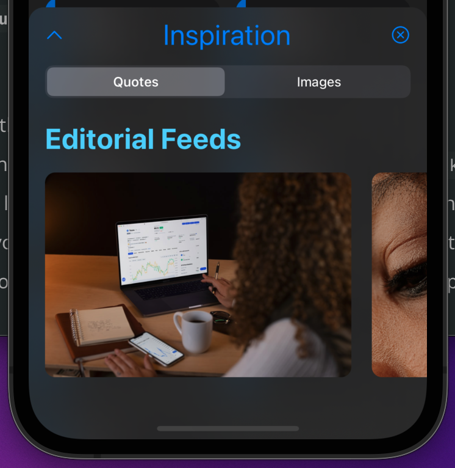
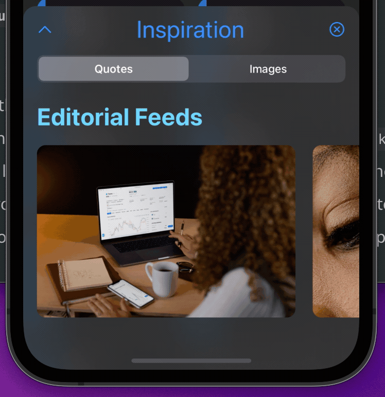
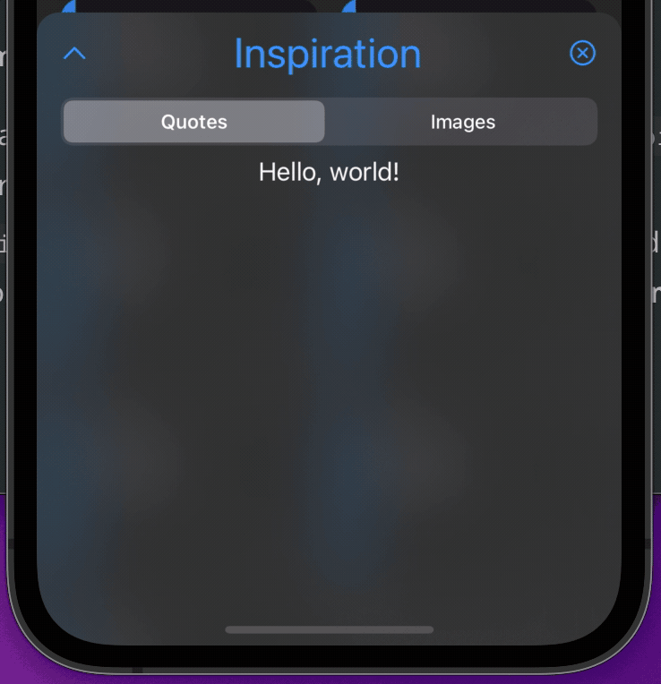
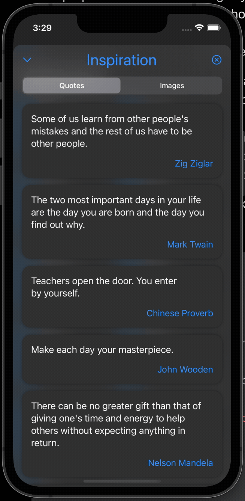
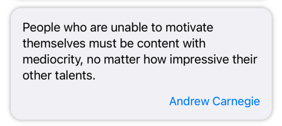

In this assignment, you will practice how to initiate an API request, fetch data from the API endpoint, parse the data, and present the data in your app.

I've noticed that quite a few people are struggling with previous assignments, so I intentionally rewrote assignment 3 and 4 to make them easier, instead of using prompts I originally planned. Meanwhile, I also wish you to put more time on your final project.

Estimated Time to Complete this Assignment:
- If you are already mastered all materials covered in the lecture, you probably can get this one done ~1-2 hrs.
- If you need to revisit some concepts, you probably still can get this done in ~3-6 hrs.

This assignment's skeleton code is based on the solution of assignment 2, which should be similar to the starter code of assignment 3.
{:.note title="Note"}

## Stage 1 (30 Pts in total)

> Let's create a picker to let users switch between `Quote` and `Images`.

In this stage, you will create a picker in the `InspirationView` to let users switch between `QuoteView` (you will implement it in the later stage) and `ImageGalleryView`. This might be the most challenging part of this entire assignment as you have to learn how to use `Picker` and practice the usage of `enum`.

### Stage 1.1 (15 Pts)

In this sub-stage, you need to go over the official document on `Picker` from [here](https://developer.apple.com/documentation/swiftui/picker). You can focus on all code snippets in that document to have a general idea of how to use the `Picker`. After that, you need to create an `enum` which will be used in our picker later. 

**There are some requirements:**
1. **You must create this `enum` in the file `Views/InspirationViews/InspirationView.swift`.** 
2. Your `enum` must have and only have two cases. One is named `quotes` and another one is named `images`. They represent two different views that users want to display.
3. Your `enum` must conform to the `CaseIterable` protocol so that you can use `.allCases` to iterate over all cases later in the `Picker`.
4. Your `enum` must have a computed variable named `name: String`, which will return the **capitalized** string of each case. For example, if your `enum` is named as `InspirationType`, then when you access `InspirationType.quotes.name` it returns a capitalized `String` - "Quotes". If you access `InspirationType.images.name`, it returns a capitalized `String` - "Images".

**Hints:**
1. You can conform your `enum` to the `String` protocol. Then you can get a `String` representation of each case in your `enum` by using `.rawValue`.  
   
   For example (assume your `enum` is named as `InspirationType`), if your `enum` conforms to the `String` protocol, you can use `InspirationType.quotes.rawValue` to get a `String` value - "quotes". Or, you can also use `self.rawValue` in your `enum` too, which has the same behavior.

2. `.capitalized` is already defined on every `String` type variable in the standard library. You can use this handy tool to get the capitalized string.
3. `CaseIterable` and `enum` are covered in the previous lecture when we went over the Swift Type Systems.

**Grade Breakdown:**

* (5 pt) Correctly create the `enum` in the right file.
* (5 pt) Correctly conform to the `CaseIterable` protocol.
* (5 pt) Correctly implement the `name` computed variable.


### Stage 1.2 (10 Pts)

In this sub-stage, you will create the `Picker` in our `InspirationView`. Go to the file `Views/InspirationViews/InspirationView.swift` again, and you will work on this file. TODO comments are available in the skeleton code.

Find the right place and declare your `Picker` here. The `Picker` will display two different tabs - `Images` and `Quotes` (capitalized). You can use the `name` computed variable defined in the previous sub-stage.

The expected result of this sub-stage should be something like this:

| Image | Interaction with Picker |
| :---: | :---: |
|  | 

**You must utilize `.allCases` on `enum` to loop through all cases in the `enum`.**

**Hints:**
1. We will use `.segmented` style for the `Picker`.
2. You can apply picker style by calling the view modifier `.pickerStyle()` on the `Picker`.
3. You can use `EmptyView()` for the label of the `Picker`, as it won't be displayed in the style we use anyway.
4. Depends on the different initializers you may use, the title for the `Picker` doesn't matter as well.
5. The usage of `.allCases` is also covered in the previous lecture during the Swift Type System.

**Grade Breakdown:**

* (5 pt) Correctly declare the `Picker` at the right place with the right style.
* (5 pt) Correctly utilize `.allCases` to loop over all cases in the `Picker`.

### Stage 1.3 (5 Pts)

In this sub-stage, you will need to create the `QuoteView` (you can just leave it as a template file, we will finish it up in the later stage). You will use a `switch` statement on two views - `QuoteView` and `ImageGalleryView`, so that users can finally switch between two views by selecting a different choice in the `Picker` we declared before.

The expected result of this sub-stage should be something like this:



**There are some steps and requirements to follow:**
1. You need to create a SwiftUI file named `QuoteView.swift` in the folder `Views/InspirationViews`. You can just leave it as the template file for now.
2. Go to the file `Views/InspirationViews/InspirationView`, and find the right place to add a `switch` statement to conditionally display `QuoteView` or `InspirationView` based on users' choice. **You must use the `switch` statement here.**

**Grade Breakdown:**

* (5 pt) Correctly use the `switch` statement to conditionally display one of two views.


## Stage 2 (60 Pts in total)

> Let's create our `QuoteView`!

In this stage, we will take a close look at the API we will use. We will create the API service, view, model, and view model for the `QuoteView`.


Don't pay anything for the API. The API service we will use in this assignment is hosted and managed by a 3rd-party platform. We will only use the free part of the API service for this assignment.
{:.note title="Important Notes"}


### Stage 2.1 (15 Pts)

In this sub-stage, you will get familiar with the API service we will use for this assignment. We will use the API service provided by [ZenQuotes.io](https://zenquotes.io/).

You can read the full documentation of this API service from their website: [https://premium.zenquotes.io/zenquotes-documentation/](https://premium.zenquotes.io/zenquotes-documentation/).

Or, you can also check the payload by directly accessing the endpoint: [https://zenquotes.io/api/quotes](https://zenquotes.io/api/quotes).

After reviewing the payload returned by the API endpoint, you should see something like this (example from the official document):

```
[{
	"q": "Lack of emotion causes lack of progress and lack of motivation.",
	"a": "Tony Robbins",
	"i": "https://zenquotes.io/img/tony-robbins.jpg",
	"c": "63",
	"h": "<blockquote>&ldquo;Lack of emotion causes lack of progress and lack of motivation.&rdquo; &mdash; <footer>Tony Robbins</footer></blockquote>"
},
// ...MORE DATA... //
{
	"q": "The friend is the man who knows all about you, and still likes you.",
	"a": "Elbert Hubbard",
	"i": "https://zenquotes.io/img/elbert-hubbard.jpg",
	"c": "67",
	"h": "<blockquote>&ldquo;The friend is the man who knows all about you, and still likes you.&rdquo; &mdash; <footer>Elbert Hubbard</footer></blockquote>"
}]
```

Based on this pattern and structure, create a file named `Quote.swift` in the folder `Models`. Inside the newly created `Quote.swift` file, create a struct named `Quote` to represent each individual "quote".

**There are some requirements:**
1. You are responsible for creating the right fields with the correct name in your `Quote` struct based on the payload you observe.
2. You must name all fields in the `Quote` according to the field name in the payload. You are not allowed to use `CodingKeys` here to customize the field name. However, I do encourage you to do that beyond this assignment.
3. You are responsible for conforming this struct to the right protocol, which makes the struct can be decoded from a JSON string.
4. You might need to set one or more fields to the `Optional` type, as the payload might not always return all fields that are shown in the official document, or the example above. However, we will not use these fields that are not returned in the payload. Therefore, it's ok if you just do not declare them in the code at all.

**Grade Breakdown:**

* (10 pt) Correctly create the file and struct.
* (5 pt) Correctly conform to the right protocol, which makes the struct can be decoded from a JSON string.

### Stage 2.2 (15 Pts)

In this sub-stage, you need to create an API service class to provide an interface by which we can initiate the API request and parse the data correctly.

Again, the endpoint we will use is: [https://zenquotes.io/api/quotes](https://zenquotes.io/api/quotes)

**There are some steps and requirements to follow:**
1. First, you must create a Swift file named `QuoteAPIService.swift` in the folder `Services`.
2. You must create a class in that newly created `QuoteAPIService.swift` file. Your class should be named `QuoteAPIService`.
3. In your `QuoteAPIService` class, you must provide a static async function named `getQuotes()`.

   The full signature: 
   ```
   static func getQuotes() async -> [Quote]?
   ``` 
   It takes nothing but returns an `Optional` of an array of `Quote`s.

4. In the `getQuotes()` function, you need to initiate an API request to the endpoint, fetch the data, and use `JSONDecoder` to decode the data into an array of `Quote`s.
5. You should handle errors in the function `getQuotes()`. If an error occurs, simply return `nil`. A `guard let` or `if let` binding is efficient.
6. You must check the HTTP response code. Namely, you should check whether the response code is 200, which indicates a successful action. If it's not, again, return `nil`.
7. You must use `try-do-catch` block on `URLSession.shared.data()` to catch and print the error if an error occurs.
8. You must use `try?` when calling `JSONDecoder().decode()`.
9. The last two requirements are just to ensure you know how to apply different styles of error handling on your own.

**Grade Breakdown:**

* (5 pt) Correctly check the HTTP response code and return `nil` when the response code is not 200.
* (5 pt) Correctly use `try-do-catch` block on `URLSession.shared.data()` and print errors if necessary.
* (5 pt) Correctly use `try?` on `JSONDecoder().decode()`.

### Stage 2.3 (15 Pts)

In this sub-stage, you need to create a view model for the `QuoteView`.

**There are some steps and requirements to follow:**
1. You must create a Swift file named `QuoteViewModel.swift` in the folder `ViewModels`.
2. In the newly created `QuoteViewModel.swift` file, you need to create a class named `QuoteViewModel` which will be the view model to bridge the view and model for quotes.
3. You must conform to the right protocol for this view model.
4. In this `QuoteViewModel`, you must have a field - `quotes: [Quote]`. We will fetch the `Quote`s via API request and assign the returned array to this variable later. We will also use this variable to display `Quote`s in our `QuoteView` later. Therefore, you must mark this field with the right property wrapper.
5. You must provide a function named `loadQuotes()`.

   The full signature:
   ```
   func loadQuotes() async
   ```

   In this function, you need to call the `getQuotes()` function that we just defined in the previous stage in the class `QuoteAPIService`. If the returned data from the `getQuotes()` function is not `nil`, you need to assign the returned data to the `quotes` variable, which is defined in step 4. Otherwise, just do nothing.
6. For step 5, you must ensure the data assignment happens in the right `Actor`.
7. You are encouraged to check whether the Task is canceled and early terminate the execution in the `loadQuotes()` function. This is a good practice.

**Grade Breakdown:**

* (5 pt) Correctly create and declare the `QuoteViewModel` and conform to the right protocol.
* (5 pt) Correctly declare the `quotes: [Quote]` marked with the right proper wrapper.
* (5 pt) Correctly define the `loadQuotes()` function and meets all requirements listed.

### Stage 2.4 (15 Pts)

In this sub-stage, you need to finish up the `QuoteView` we created in the first stage. You will also need to link `QuoteView` and `QuoteViewModel` up, calling the `loadQuotes()` function and display all `Quote`s.

The expected result should be something like this:

| In QuoteView Preview | In InspirationView with Dark Mode | Text Selection Enabled |
| :---: | :---: | :---: |
|  |   |    |


You will work on the file `Views/InspirationViews/QuoteView.swift`.

**There are some steps and requirements to follow:**
1. Declare a local instance of `QuoteViewModel` marked with the right proper wrapper. `@ObservedObject` or `@StateObject`?
2. Replace the template code with your own implementation of the `QuoteView`.
3. The layout of each `Quote` card should be like this:
   
   

4. The quote and author text must both be selectable by long pressing. See the hint section. You don't need to set up the share functionality when doing a long press.
5. You can use the `Color.secondarySystemBackground` as the background color of each quote card. This color is defined in your first assignment.
6. You must use `.task` to call the `loadQuotes()` function. 
7. You can apply a shadow to each quote card, which can add some nice visual effects.

**Hints:**
1. You can use `.textSelection()` view modifier on the `Text` to enable the text selection.
2. You can use `.multilineTextAlignment()` to adjust the multiline alignment behavior for the `Text` if you need it.

**Grade Breakdown:**

* (5 pt) Correctly create the `QuoteView` and have a similar layout for each quote and similar behavior as expected.
* (5 pt) Correctly use `.task` to call the `loadQuotes()` function.
* (5 pt) Correctly display all quotes as shown in the GIFs or images in the prompt. 

## Stage 3 (10 Pts in total)

> Commit, Push, and Submit

Remember to commit your code changes and push the change to GitHub before the deadline.

Even if you intend to use late policy, you still need to submit your repository link on Canvas before the original deadline to get the 10 points.

**Grade Breakdown:**
- (10 pt) A valid GitHub repository link is submitted on Canvas before the original deadline.
